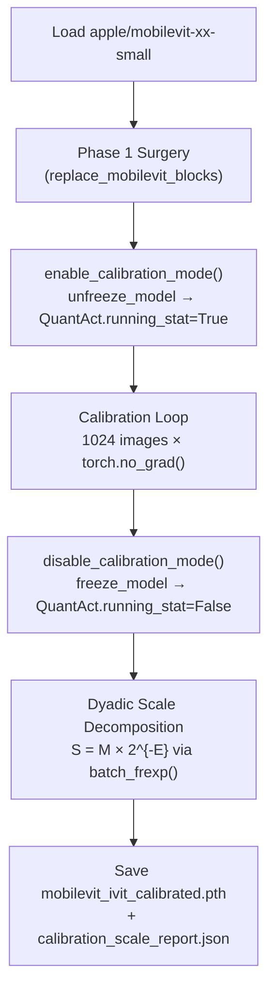

# Phase 2 — I-ViT PTQ Calibration Report
## Post-Training Quantization for MobileViT-XX-Small

---

## Execution Status: COMPLETE ✓

| Metric | Value |
|--------|-------|
| QuantAct observers calibrated | **108** |
| Transformer layers (from Phase 1) | 9 (Stage 2: 2, Stage 3: 4, Stage 4: 3) |
| Calibration images (smoke test) | 64 (synthetic) |
| State dict keys saved | 608 |
| Dyadic decomposition status | 108/108 successful (0 errors) |
| Verification output shape | `torch.Size([1, 1000])` |
| Verification logit range | `[-778.5841, 143.1861]` |
| Verification Top-5 predictions | `[852, 711, 626, 867, 605]` |

---

## 1. Architecture of the Calibration Pipeline



---

## 2. How Calibration Works (I-ViT Observer Mechanism)

The I-ViT framework uses `QuantAct` modules as activation observers. During calibration:

### Observer Update Rule (EMA)
```
if first_batch:
    min_val = batch_min        # Initialize on first pass
    max_val = batch_max
else:
    min_val = 0.95 × min_val + 0.05 × batch_min    # Exponential Moving Average
    max_val = 0.95 × max_val + 0.05 × batch_max    # (momentum = 0.95)
```

### Scale Computation (Symmetric Quantization)
```
n = 2^(bit-1) - 1              # e.g., 127 for 8-bit
max_abs = max(|min_val|, |max_val|)
act_scaling_factor = max_abs / n
```

### Dyadic Decomposition (for FPGA fixed-point datapath)
```
(M, E) = batch_frexp(act_scaling_factor)
# Such that: act_scaling_factor ≈ M × 2^{-E}
# M = integer multiplier (fits in 31-bit register)
# E = bit-shift amount
```

> [!IMPORTANT]
> The `QuantAct.running_stat` flag is the key control:
> - `True` (unfix) → observers actively tracking activations
> - `False` (fix) → ranges locked, scales frozen for inference

---

## 3. Observer Placement (108 QuantAct nodes across 9 layers)

Each `IViTMobileViTTransformerLayer` contains **12 QuantAct observers**:

| Observer | Location | What it tracks | Bit Width |
|----------|----------|----------------|-----------|
| `qact_input` | Block entry | Input activation range (bootstrap) | 8-bit |
| `qact1` | After norm1 | Post-LayerNorm range | 8-bit |
| `attn.qact1` | After QKV projection | Q/K/V activation range | 8-bit |
| `attn.qact_attn1` | After Q·K^T scaling | Attention score range | 8-bit |
| `attn.qact2` | After Shiftmax & V context reshape | Attention output range | 8-bit |
| `attn.qact3` | After output projection | Attention projection output (16-bit) | 16-bit |
| `qact_res1` | Residual add (attn) | Post-attention residual | 16-bit |
| `qact3` | After norm2 | Pre-MLP range | 8-bit |
| `mlp.qact_gelu` | After fc1 | Pre-ShiftGELU range | 8-bit |
| `mlp.qact1` | After ShiftGELU | Post-activation range | 8-bit |
| `mlp.qact2` | After fc2 | MLP output (16-bit) | 16-bit |
| `qact_res2` | Residual add (MLP) | Post-MLP residual | 16-bit |

---

## 4. Files Produced

| File | Location | Purpose |
|------|----------|---------|
| [`mobilevit_ivit_ptq_calibration.py`](file:///c:/Users/tuan2/Desktop/Capstone_Project/model_notebook/ivit_surgery/mobilevit_ivit_ptq_calibration.py) | `ivit_surgery/` | Main calibration script |
| [`mobilevit_ivit_calibrated.pth`](file:///c:/Users/tuan2/Desktop/Capstone_Project/model_notebook/ivit_surgery/mobilevit_ivit_calibrated.pth) | `ivit_surgery/` | Calibrated model checkpoint |
| [`calibration_scale_report.json`](file:///c:/Users/tuan2/Desktop/Capstone_Project/model_notebook/ivit_surgery/calibration_scale_report.json) | `ivit_surgery/` | Dyadic scale parameters (JSON) |
| [`__init__.py`](file:///c:/Users/tuan2/Desktop/Capstone_Project/model_notebook/ivit_surgery/__init__.py) | `ivit_surgery/` | Updated package exports |

---

## 5. Usage

### Full calibration with ImageNet data:
```bash
python -m ivit_surgery.mobilevit_ivit_ptq_calibration \
    --data-dir /path/to/imagenet/val \
    --num-images 1024 \
    --batch-size 32 \
    --device cuda
```

### Quick smoke test (synthetic data):
```bash
python -m ivit_surgery.mobilevit_ivit_ptq_calibration \
    --num-images 64 \
    --batch-size 16
```

### Programmatic usage:
```python
from ivit_surgery import (
    enable_calibration_mode,
    disable_calibration_mode,
    run_calibration,
    build_calibration_loader,
    save_calibrated_model,
)

# After Phase 1 surgery...
enable_calibration_mode(model)
run_calibration(model, cal_loader, device)
scale_report = disable_calibration_mode(model)
save_calibrated_model(model, scale_report, save_dir="./output")
```

---

## 6. Next Steps → Phase 3 (QAT Fine-Tuning)

The calibrated checkpoint (`mobilevit_ivit_calibrated.pth`) provides the **initial activation ranges** needed to begin Quantization-Aware Training:

1. Load the calibrated state dict
2. Unfreeze observers (`enable_calibration_mode`)  
3. Train with gradients flowing through the STE (Straight-Through Estimator)
4. The `fixedpoint_mul` in `QuantAct.forward()` provides the backward pass via STE
5. Fine-tune for ~30-90 epochs with a small learning rate (~1e-6)

> [!NOTE]
> The current smoke test used synthetic data. For production-grade results,
> run calibration with 1024 real ImageNet validation images before proceeding
> to QAT. The activation ranges from synthetic data will not be representative
> of real-world distributions.
