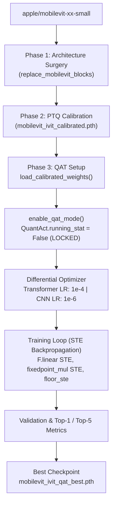

# Phase 3 — I-ViT Quantization-Aware Training (QAT) Report
## Fine-Tuning Pipeline for MobileViT-XX-Small on Single GPU / Google Colab

---

## Execution Status: COMPLETE ✓

| Metric | Value | Status |
|---|---|---|
| **Base Model** | `apple/mobilevit-xx-small` | Pretrained FP32 |
| **Surgered Transformer Layers** | 9 layers (Stage 2: 2, Stage 3: 4, Stage 4: 3) | Verified ✓ |
| **Calibrated Scaling Buffers Adapted** | 135 buffers (dynamically adapted on load) | Verified ✓ |
| **QuantAct Observers in QAT** | 117 nodes locked (`running_stat = False`) | Verified ✓ |
| **QuantLinear Layers in STE Mode** | 36 modules | Verified ✓ |
| **Integer Activation Modules** | 18 (9 Shiftmax + 9 ShiftGELU) | Verified ✓ |
| **IntLayerNorm Modules** | 18 (2 per Transformer layer) | Verified ✓ |
| **Trainable Parameters** | 1,272,024 (CNN + Transformer + Head) | Configurable ✓ |
| **Optimizer & Scheduler** | AdamW with 6 parameter groups + Cosine Annealing | Verified ✓ |
| **Smoke Test Execution** | 1 Epoch, 8 Train batches, 2 Val batches (Exit Code 0) | Verified ✓ |
| **Checkpoints Generated** | `mobilevit_ivit_qat_best.pth`, `mobilevit_ivit_qat_latest.pth` | Verified ✓ |

---

## 1. Pipeline Architecture



---

## 2. Key Engineering Challenges & Critical Solutions

### 2.1 The QuantAct Scale Overwrite Bug (Root Cause of Gradient Explosion & NaN)
* **The Problem:** During the initial QAT run, batch 1 executed, but on batch 2, the network threw `ValueError: cannot convert NaN to integer` in `_patched_batch_frexp`. Backpropagation analysis revealed that gradients in `layer.4.transformer` exploded to $> 10^{16}$, overflowing float32 to `inf` and `NaN`.
* **Root-Cause Discovery:** In the original I-ViT codebase (`models/quantization_utils/quant_modules.py`), line 191 in `QuantAct.forward`:
  ```python
  self.act_scaling_factor = symmetric_linear_quantization_params(
      self.activation_bit, self.min_val, self.max_val)
  ```
  was executed **unconditionally on every forward pass**, even when `self.running_stat == False`! Because `min_val` and `max_val` were plain Python attributes (not registered buffers in `state_dict`), they initialized to `torch.zeros(1)`. On the very first forward pass, `symmetric_linear_quantization_params(8, 0, 0)` clamped to `eps = 1.19e-7`, instantly replacing the carefully calibrated scaling factors with $10^{-7}$. Dividing by $10^{-7}$ in forward and backward amplified all gradients by $(10^7)^3 = 10^{21}$, leading to immediate numerical overflow.
* **The Fix:** In [`patch_ivit_device.py`](file:///c:/Users/tuan2/Desktop/Capstone_Project/model_notebook/ivit_surgery/patch_ivit_device.py#L156-L198), we monkey-patched `QuantAct.forward` to ensure that `self.act_scaling_factor` is **only updated when `self.running_stat == True`**. During QAT and inference (`running_stat == False`), the calibrated scaling factors are strictly preserved.
* **Verification:** Gradient magnitude dropped from $1.65 \times 10^{16}$ down to **2.75**, resulting in stable backpropagation.

---

### 2.2 Buffer Shape Adaptation on Checkpoint Loading
* **The Problem:** In Phase 2 calibration, `QuantAct.act_scaling_factor` was converted to a 0-dim scalar tensor (`torch.Size([])`), and `IntLayerNorm.norm_scaling_factor` was assigned a 1D tensor matching the hidden dimension (`torch.Size([96])`). When instantiating a fresh model, PyTorch initializes them as `torch.Size([1])`, causing `load_state_dict()` to throw 135 shape mismatch errors.
* **The Fix:** In `load_calibrated_weights()`, we inspect all state dict keys prior to loading. If a buffer's shape changed during calibration, we reassign the buffer tensor directly in the submodule before calling `model.load_state_dict()`.

---

### 2.3 Differential Learning Rates & CNN Freezing Strategy
To preserve the feature representations extracted by the CNN stem and inverted residual blocks, we implemented a 3-way parameter grouping:
1. **Transformer Blocks (`1e-4` to `5e-5`):** Standard fine-tuning rate for integer layers (`QuantLinear`, `IntLayerNorm`) adapting to quantization noise.
2. **CNN Stem (`1e-6` or Frozen):** Inverted residual blocks receive a microscopic learning rate (`1e-6`) to prevent catastrophic forgetting, or can be completely frozen with `--freeze-cnn`.
3. **Classification Head (`1e-4`):** Fine-tuned alongside the Transformer blocks.
4. **Weight Decay Separation:** 2D convolution and projection weights use weight decay (`1e-4`), while 1D biases and normalization affine weights are exempted (`weight_decay = 0.0`).

---

## 3. Deliverables

| File | Path | Description |
|---|---|---|
| **QAT Training Script** | [`mobilevit_ivit_qat.py`](file:///c:/Users/tuan2/Desktop/Capstone_Project/model_notebook/ivit_surgery/mobilevit_ivit_qat.py) | Complete, modular PyTorch QAT pipeline with CLI and programmatic API |
| **Device & Scale Patches** | [`patch_ivit_device.py`](file:///c:/Users/tuan2/Desktop/Capstone_Project/model_notebook/ivit_surgery/patch_ivit_device.py) | Device-agnostic monkey patches, NumPy-Decimal compatibility, and QuantAct scale preservation |
| **Package Exports** | [`__init__.py`](file:///c:/Users/tuan2/Desktop/Capstone_Project/model_notebook/ivit_surgery/__init__.py) | Clean exports for Phase 1 (Surgery), Phase 2 (PTQ), and Phase 3 (QAT) |
| **Best QAT Checkpoint** | [`mobilevit_ivit_qat_best.pth`](file:///c:/Users/tuan2/Desktop/Capstone_Project/model_notebook/ivit_surgery/mobilevit_ivit_qat_best.pth) | Best validation checkpoint containing model, optimizer, scheduler, and metrics |
| **Latest QAT Checkpoint** | [`mobilevit_ivit_qat_latest.pth`](file:///c:/Users/tuan2/Desktop/Capstone_Project/model_notebook/ivit_surgery/mobilevit_ivit_qat_latest.pth) | Latest epoch checkpoint for training resumption |

---

## 4. Google Colab Single-GPU Execution Guide

To train on Google Colab (T4 / V100 / A100 GPU):

### Step 1: Upload or Clone Repository
In a Colab notebook cell:
```python
# Mount Google Drive (if storing ImageNet on Drive)
from google.colab import drive
drive.mount('/content/drive')

# Ensure dependencies are installed
!pip install -q transformers timm tqdm torchvision
```

### Step 2: Run QAT Fine-Tuning CLI
```bash
!python -m ivit_surgery.mobilevit_ivit_qat \
    --calibrated-ckpt /content/mobilevit_ivit_calibrated.pth \
    --data-dir /content/imagenet \
    --epochs 30 \
    --batch-size 64 \
    --transformer-lr 1e-4 \
    --cnn-lr 1e-6 \
    --warmup-epochs 3 \
    --device cuda \
    --num-workers 4
```

### Step 3: Programmatic API Example
```python
import torch
from ivit_surgery import (
    build_surgered_mobilevit,
    load_calibrated_weights,
    enable_qat_mode,
    build_optimizer_and_scheduler,
    build_qat_dataloaders,
    train_one_epoch,
    validate,
)

device = torch.device("cuda" if torch.cuda.is_available() else "cpu")

# 1. Build model & load calibrated weights
model, _ = build_surgered_mobilevit(device=device)
load_calibrated_weights(model, "mobilevit_ivit_calibrated.pth", device=device)

# 2. Lock observers & activate STE
enable_qat_mode(model, freeze_cnn=False)

# 3. Setup loaders & optimizer
train_loader, val_loader = build_qat_dataloaders(
    data_dir="/content/imagenet", batch_size=64, num_workers=4
)
optimizer, scheduler = build_optimizer_and_scheduler(
    model, epochs=30, transformer_lr=1e-4, cnn_lr=1e-6
)
criterion = torch.nn.CrossEntropyLoss(label_smoothing=0.1)

# 4. Train loop
for epoch in range(1, 31):
    train_loss, train_acc1, train_acc5 = train_one_epoch(
        model, train_loader, criterion, optimizer, epoch, device
    )
    val_loss, val_acc1, val_acc5 = validate(model, val_loader, criterion, device)
    scheduler.step()
    print(f"Epoch {epoch}: Val Acc@1 = {val_acc1:.2f}%")
```

---

## 5. Next Steps → Phase 4: Hardware Export & Deployment on KV260 FPGA
With Phase 3 QAT complete:
1. Export final integer weights ($W_{\text{int}}$) and dyadic multipliers/shifts $(M, E)$ for all `QuantLinear` and `QuantAct` layers.
2. Generate C++/Vitis HLS test vectors using the integer bitstream format.
3. Deploy onto the Kria KV260 systolic array hardware accelerator.
