# BÁO CÁO PHÂN TÍCH TOÀN DIỆN LỖI GIẢI PHẪU (SURGERY), CALIBRATION (PTQ) VÀ FINE-TUNING (QAT) CHO MÔ HÌNH MOBILEVIT-XXS + I-VIT

**Mã tài liệu:** `REPORT_SURGERY_QAT_FLAWS_20261010_0939`  
**Thời gian khởi tạo:** 10/10/2026 — 09:39:00 (GMT+7)  
**Tác giả:** Senior AI & SW-HW Co-Design Engineer (Antigravity Pairing Session)  
**Mục tiêu dự án:** Tích hợp khối I-ViT Transformer (Integer-only) vào MobileViT-XXS (Apple pre-trained 69% Top-1 ImageNet) nhằm trích xuất Golden Model cho thiết kế vi mạch RTL và tăng tốc trên SoC AMD Kria KV260 (ARM PS + FPGA PL).  
**Hiện trạng:** Zero-shot baseline sau phẫu thuật/định cỡ có Loss > 2900 và Acc ~0.1%; Fine-tuning QAT 40 epochs bị "nghẽn cổ chai" ở mức 50 ± 2%.

---

## BẢNG LỊCH SỬ THAY ĐỔI (CHANGELOG)

| Phiên bản | Thời gian | Người thực hiện | Nội dung cập nhật |
| :--- | :--- | :--- | :--- |
| **v1.0.0** | 2026-10-10 09:39:00 | Senior AI Engineer | Khởi tạo báo cáo toàn diện phân tích nguyên nhân gốc rễ và kiểm toán chi tiết 3 Phase (Surgery, Calibration, QAT) cùng liên kết SW-HW RTL. |

---

## 1. TỔNG QUAN VẤN ĐỀ & MA TRẬN NGUYÊN NHÂN GỐC RỄ (ROOT CAUSE MATRIX)

### 1.1 Hiện tượng quan sát được
1. **Zero-shot Baseline sau phẫu thuật / Calibrated Checkpoint:** Loss vọt lên trên 2900+, Accuracy sụp đổ về mức ngẫu nhiên **0.1%** (1/1000 - tương đương mô hình rỗng).
2. **QAT Fine-tuning 40 Epochs:** Quá trình huấn luyện không thể hồi phục lại độ chính xác gốc 69% của Apple, bị kẹt cứng (plateau) quanh vùng **50 ± 2%**.

### 1.2 Ma trận nguyên nhân gốc rễ

```mermaid
graph TD
    A["Accuracy Plateau 50% & Baseline 0.1%"] --> B["Nhóm 1: Dữ liệu & Tiền xử lý (Data Pipeline)"]
    A --> C["Nhóm 2: Giải phẫu mô hình (Phase 1 Surgery)"]
    A --> D["Nhóm 3: Định cỡ PTQ (Phase 2 Calibration)"]
    A --> E["Nhóm 4: Huấn luyện QAT (Phase 3 Loop & Optimizer)"]
    A --> F["Nhóm 5: Tương thích phần cứng RTL KV260"]

    B --> B1["Lệch kênh màu RGB vs BGR (Apple dùng BGR)"]
    B --> B2["Chuẩn hóa sai [0, 1] vs ImageNet Mean/Std"]
    B --> B3["Mất đồng bộ nhãn ImageFolder khi stream tập mini"]

    C --> C1["SiLU (Swish) bị ép thay bằng ShiftGELU (hệ số 1.702)"]
    C --> C2["QKV chung 1 Scale QuantAct làm hẹp dải động"]
    C --> C3["Dequant/Quant liên tục giữa các Transformer layer"]

    D --> D1["Dùng ảnh nhiễu ngẫu nhiên Gaussian để Calibration"]
    D --> D2["Momentum 0.95 với quá ít batch làm Scale bị kẹt"]

    E --> E1["FREEZE_CNN=False làm hỏng BatchNorm Running Stats"]
    E --> E2["LR vi sai và Warmup chưa tối ưu, Grad Clip 0.5 quá chặt"]
    E --> E3["STE Gradient bão hòa / triệt tiêu ở các nút bậc thang"]

    F --> F1["Scale 1/sqrt(d_k) không khớp giữa bit-shift và Dyadic"]
    F --> F2["Toán tử Shiftmax phần mềm vs RTL Softmax LUT"]
```



---

## 2. PHÂN TÍCH CHI TIẾT PHASE 1: GIẢI PHẪU MÔ HÌNH (ARCHITECTURE SURGERY)

Tệp nguồn kiểm toán: [`mobilevit_ivit_surgery.py`](file:///c:/Users/tuan2/Desktop/Capstone_Project/model_notebook/ivit_surgery/mobilevit_ivit_surgery.py) và [`patch_ivit_device.py`](file:///c:/Users/tuan2/Desktop/Capstone_Project/model_notebook/ivit_surgery/patch_ivit_device.py).

### 2.1 Lỗi 1.1: Bất tương thích hàm kích hoạt SiLU (Swish) và ShiftGELU
* **Chi tiết kỹ thuật:** Hugging Face MobileViT của Apple sử dụng `silu` ($f(x) = x \cdot \sigma(x)$) trong khối MLP (`MobileViTIntermediate`). Khối I-ViT thay thế bằng `IntGELU` (ShiftGELU):
  $$\text{ShiftGELU}(x) = x \cdot \sigma(1.702 \cdot x)$$
* **Hậu quả:** Hàm GELU nhân thêm hệ số độ dốc $1.702$ vào đối số của Sigmoid. Khi ép trọng số pre-trained vốn được tối ưu cho SiLU vào ShiftGELU mà không bù trừ tỷ lệ, toàn bộ phân phối kích hoạt sau tầng `mlp.fc1` bị co hẹp dải phi tuyến và lệch điểm bão hòa.

### 2.2 Lỗi 1.2: Ép chung Scaling Factor cho cả 3 ma trận Q, K, V qua `qact1`
* **Chi tiết kỹ thuật:** Trong `IViTSelfAttention.forward`:
  ```python
  x, act_scaling_factor = self.qkv(x, act_scaling_factor)
  x, act_scaling_factor_1 = self.qact1(x, act_scaling_factor)
  qkv = x.reshape(B, N, 3, self.num_attention_heads, C // self.num_attention_heads).permute(2, 0, 3, 1, 4)
  q, k, v = qkv[0], qkv[1], qkv[2]
  ```
* **Hậu quả:** Tầng `qkv` tạo ra tensor kích thước kênh $3 \times C$. Đi qua `qact1` (QuantAct bậc 8-bit), hàm `symmetric_linear_quantization_params` tính một giá trị scale duy nhất từ $\max(|v|)$ của toàn bộ $3C$ kênh:
  $$S = \frac{\max(|Q_{\min}|, |Q_{\max}|, |K_{\min}|, |K_{\max}|, |V_{\min}|, |V_{\max}|)}{127}$$
  Nếu một trong ba ma trận (ví dụ $V$) có dải giá trị lớn gấp đôi $Q$ và $K$, thì $Q$ và $K$ sẽ bị lượng tử hóa với scale quá lớn, dẫn đến việc các phần tử của $Q$ và $K$ chỉ nhận các giá trị nguyên rất nhỏ (quanh $0, \pm 1, \pm 2$), gây mất trầm trọng độ phân giải góc chú ý (Attention Map resolution).

### 2.3 Lỗi 1.3: Cầu nối Dequantize $\rightarrow$ Quantize trung gian giữa các Transformer Layers
* **Chi tiết kỹ thuật:** Trong MobileViT, mỗi Stage có nhiều Transformer Layer nối tiếp (Stage 2 có 2 lớp, Stage 3 có 4 lớp, Stage 4 có 3 lớp).
* **Vấn đề:** Lớp `IViTMobileViTTransformerLayer` nhận tensor thực (FP32), lượng tử hóa đầu vào bằng `qact_input`, tính toán số nguyên, rồi tại lối ra của block lại nhân với scale để trả về FP32 (`return x`). Lớp Transformer tiếp theo ngay sau đó lại nhận FP32 đó và đưa vào `qact_input` mới để lượng tử hóa lại!
* **Hậu quả:** Việc "lượng tử hóa $\rightarrow$ giải lượng tử hóa $\rightarrow$ lượng tử hóa lại" liên tục 4 lần ở Stage 3 gây tích lũy sai số làm tròn kép (double rounding error) và làm đứt đoạn luồng dyadic scale xuyên suốt.

### 2.4 Lỗi 1.4: Nguy cơ chia cho 0 và Scale âm tại `IntLayerNorm`
* **Chi tiết kỹ thuật:** Trong `IntLayerNorm.forward`:
  ```python
  bias = self.bias.data.detach() / (self.weight.data.detach())
  scaling_factor = scaling_factor * self.weight
  ```
* **Vấn đề:** 
  1. Nếu bất kỳ trọng số affine nào trong `self.weight` tiến về $0$ trong quá trình huấn luyện AdamW, phép chia `bias / self.weight` sẽ sinh ra `Inf`/`NaN`.
  2. Nếu `self.weight` âm, `scaling_factor` sẽ thành số âm, làm hỏng thuật toán phân rã Dyadic `batch_frexp` (vốn giả định scale dương).

---

## 3. PHÂN TÍCH CHI TIẾT PHASE 2: ĐỊNH CỠ LƯỢNG TỬ (PTQ CALIBRATION)

Tệp nguồn kiểm toán: [`mobilevit_ivit_ptq_calibration.py`](file:///c:/Users/tuan2/Desktop/Capstone_Project/model_notebook/ivit_surgery/mobilevit_ivit_ptq_calibration.py).

### 3.1 Lỗi 2.1: Checkpoint định cỡ thực tế được tạo từ dữ liệu ngẫu nhiên (Synthetic Noise)
* **Chi tiết kỹ thuật:** Tệp [`mobilevit_ivit_calibrated.pth`](file:///c:/Users/tuan2/Desktop/Capstone_Project/model_notebook/ivit_surgery/mobilevit_ivit_calibrated.pth) hiện tại được ghi nhận cấu hình với `SyntheticCalibrationDataset` gồm 64 mẫu nhiễu Gaussian ngẫu nhiên.
* **Hậu quả:** 
  - Ảnh nhiễu Gaussian $\mathcal{N}(0, 1)$ khi qua các tầng tích chập của CNN stem sẽ tạo ra các feature map có phân phối hoàn toàn khác biệt so với các bức ảnh thực (nguồn sáng, cạnh, đối tượng thực tế).
  - Các observer `QuantAct` lưu các giá trị `min_val` và `max_val` giả mạo. Khi mang checkpoint này áp dụng cho tập ảnh thực, các giá trị kích hoạt thực tế lập tức bị clipping (cắt cụt) hoặc underflow (co cụm về 0), dẫn đến hiện tượng mô hình mất sạch độ chính xác ban đầu (rớt về 0.1%).

### 3.2 Lỗi 2.2: Không hội tụ thống kê động (EMA Momentum = 0.95)
* **Chi tiết kỹ thuật:** Công thức cập nhật của observer:
  $$\text{min\_val}^{(t)} = 0.95 \cdot \text{min\_val}^{(t-1)} + 0.05 \cdot \text{batch\_min}$$
* **Hậu quả:** Với momentum 0.95, sau $N$ batch, trọng số của giá trị khởi tạo ban đầu (vốn là 0.0) vẫn còn $(0.95)^N$. Nếu chỉ chạy 4-8 batch (smoke test), giá trị khởi tạo 0.0 chiếm tới $66\% - 81\%$ kết quả! Observer chưa hề hội tụ tới phân phối dữ liệu thực tế. Cần tối thiểu 64 đến 128 batch (1024 - 2048 ảnh thực tế) để tỉ lệ này giảm xuống dưới $1\% - 3\%$.

### 3.3 Lỗi 2.3: Bỏ quên Observer cho nút `attn.qact_softmax`
* **Chi tiết kỹ thuật:** Module `IViTSelfAttention` khởi tạo `self.qact_softmax = QuantAct()` nhưng trong hàm `forward()` tensor sau `int_softmax` không bao giờ đi qua `qact_softmax`. Buffer của nút này vĩnh viễn ở trạng thái uncalibrated (0.0).

---

## 4. PHÂN TÍCH CHI TIẾT PHASE 3: HUẤN LUYỆN QAT & VÒNG LẶP FINE-TUNING

Tệp nguồn kiểm toán: [`mobilevit_ivit_qat.py`](file:///c:/Users/tuan2/Desktop/Capstone_Project/model_notebook/ivit_surgery/mobilevit_ivit_qat.py) và notebook Colab [`MobileViT_IViT_QAT_Colab(newest).ipynb`](file:///c:/Users/tuan2/Desktop/Capstone_Project/model_notebook/ivit_surgery/MobileViT_IViT_QAT_Colab(newest).ipynb).

### 4.1 Lỗi 3.1: Hủy hoại thống kê BatchNorm của CNN Stem (`FREEZE_CNN = False` kết hợp `model.train()`)
* **Chi tiết kỹ thuật:** Trong notebook mới nhất (Cell 13):
  `FREEZE_CNN = False` được bật nhằm "thích nghi tự nhiên".
  Trong `enforce_qat_training_state()`:
  ```python
  model.train()
  if freeze_cnn:
      for name, module in model.named_modules():
          if "transformer" not in name and isinstance(module, (nn.BatchNorm2d, nn.BatchNorm1d)):
              module.eval()
  ```
  Vì `freeze_cnn = False`, đoạn mã chuyển BatchNorm về `eval()` **hoàn toàn bị bỏ qua**!
* **Hậu quả:**
  - Tất cả các lớp `BatchNorm2d` trong CNN stem (Conv Stem, Inverted Residual blocks) đều bị đặt ở chế độ `train()`.
  - Trên tập huấn luyện nhỏ (như ImageNet-mini 10-15 ảnh/lớp = 10,000 - 15,000 ảnh), các mini-batch liên tục cập nhật đè lên `running_mean` và `running_var` quý giá đã được Apple huấn luyện trên 1.28 triệu ảnh ImageNet.
  - Sau vài epoch đầu tiên, bộ trích xuất đặc trưng nền tảng của MobileViT sụp đổ hoàn toàn. Đến pha đánh giá `validate()` (chuyển sang `eval()`), BatchNorm sử dụng bộ thông số đã bị méo mó, dẫn đến Loss vọt lên hàng nghìn và Accuracy không bao giờ ngóc đầu qua mức 50%.
  - **Khẳng định nguyên tắc:** Trong QAT fine-tuning mô hình lai CNN-Transformer, BatchNorm của CNN stem **BẮT BUỘC PHẢI LUÔN Ở CHẾ ĐỘ EVAL()**.

### 4.2 Lỗi 3.2: Lệch kênh màu (RGB vs BGR) và Lệch chuẩn hóa ảnh
* **Chi tiết kỹ thuật:**
  Apple Image Processor quy định:
  ```json
  {
    "do_flip_channels": true,
    "do_resize": true,
    "size": 288,
    "crop_size": 256
  }
  ```
  Trong khi đó, hàm `get_mobilevit_transforms` trong `mobilevit_ivit_qat.py` (dòng 474-491) lại dùng:
  ```python
  transforms.ToTensor(), # Đọc theo thứ tự RGB [0, 1]
  transforms.Normalize(mean=[0.485, 0.456, 0.406], std=[0.229, 0.224, 0.225])
  ```
* **Hậu quả:**
  1. **Lệch kênh màu:** CNN stem nhận kênh Đỏ vào bộ lọc Xanh và ngược lại.
  2. **Lệch phân phối:** MobileViT gốc nhận dải pixel $[0, 1]$ BGR. Việc trừ mean chia std biến dải giá trị thành $[-2.1, 2.6]$. Tầng Convolution đầu tiên nhận dữ liệu có phân phối sai hoàn toàn so với lúc pre-train.

### 4.3 Lỗi 3.3: Lệch nhãn do cơ chế tự động đánh số của PyTorch `ImageFolder`
* **Chi tiết kỹ thuật:** Trong notebook Cell 10, khi stream tập ảnh từ Hugging Face về thư mục `train/` và `val/`:
  - Nếu số lượng thư mục lớp trong `val/` không đủ đúng 1000 lớp (hoặc bị ngắt kết nối giữa chừng, hoặc tải từ Kaggle ImageNet-mini dùng mã thư mục `n01440764`), `ImageFolder` sẽ quét và gán nhãn tuần tự $0, 1, 2, \dots, K-1$ ($K < 1000$).
  - Ngược lại, đầu ra `logits` của `apple/mobilevit-xx-small` cố định kích thước 1000 nhãn.
* **Hậu quả:** 
  - Mô hình dự đoán nhãn ImageNet gốc (ví dụ nhãn 818), nhưng target của `val_loader` lại bị gán là 5.
  - Phép so sánh sai hoàn toàn $\rightarrow$ Accuracy = 0.1%.
  - Loss tính toán giữa logit cao nhất (+10) và logit tại nhãn mục tiêu sai (-700 đến -2900) sinh ra giá trị hàm mất mát khổng lồ **Loss > 2900**!

### 4.4 Lỗi 3.4: Siết chặt Gradient Clipping quá mức (`grad_clip = 0.5`)
* **Chi tiết kỹ thuật:** Việc đặt `GRAD_CLIP = 0.5` kết hợp với các hàm xấp xỉ đạo hàm bậc thang (STE) của Shiftmax và ShiftGELU làm triệt tiêu các bước nhảy trọng số cần thiết để đưa tham số thoát khỏi các "rãnh" nhiễu lượng tử hóa INT8.

---

## 5. ĐỐI SOÁT KIẾN TRÚC SW-HW CO-DESIGN & MÔ HÌNH VÀNG RTL (KRIA KV260)

Đối soát với tài liệu vi mạch tại [`Notes/`](file:///c:/Users/tuan2/Desktop/Capstone_Project/Notes):
- [`thiet_ke_sw_hw_cho_vit.md`](file:///c:/Users/tuan2/Desktop/Capstone_Project/Notes/thiet_ke_sw_hw_cho_vit.md)
- [`mha_level_0_kien_truc_top.md`](file:///c:/Users/tuan2/Desktop/Capstone_Project/Notes/mha_level_0_kien_truc_top.md)
- [`mach_softmax_phan_cung.md`](file:///c:/Users/tuan2/Desktop/Capstone_Project/Notes/mach_softmax_phan_cung.md)
- [`khoi_scaler_unit.md`](file:///c:/Users/tuan2/Desktop/Capstone_Project/Notes/khoi_scaler_unit.md)

### 5.1 Ranh giới phân định ARM PS và FPGA PL
Trong hệ thống tăng tốc trên SoC AMD Kria KV260:
1. **FPGA PL Core (Attention Accelerator Core):**
   - Đảm nhận toàn bộ chuỗi tính toán ngốn tài nguyên nhất:
     $$\text{Attention}(Q, K, V) = \text{Softmax}\left(\frac{Q K^T}{\sqrt{d_k}}\right) V$$
   - Phần cứng gồm: Ping-Pong BRAM $\rightarrow$ Systolic Array GEMM (2x INT8 DSP Packing) $\rightarrow$ Scaler Unit $\rightarrow$ Hardware Shiftmax $\rightarrow$ GEMM $S \times V$ $\rightarrow$ AXI-Stream TX.
2. **ARM PS Core (Cortex-A53 / PYNQ Linux):**
   - Đảm nhận: CNN Stem (Conv2d, Inverted Residuals), Patch Partitioning / Reshape, LayerNorm (`IntLayerNorm`), Projection Linear (`QuantLinear`), MLP (`IntGELU`, `QuantLinear`), và Classifier Head.

### 5.2 Nguy cơ sai lệch Golden Model giữa PyTorch và RTL
1. **Khối Scaler Unit ($1/\sqrt{d_k}$):**
   - Với MobileViT-XXS, số chiều ẩn qua 3 stage lần lượt là:
     - Stage 2: hidden_size = 64, 4 heads $\rightarrow d_k = 16 \rightarrow \sqrt{d_k} = 4 = 2^2$. Phép chia cho $\sqrt{d_k}$ tương đương dịch phải số học (ASR) 2 bit.
     - Stage 3: hidden_size = 80, 4 heads $\rightarrow d_k = 20 \rightarrow \sqrt{d_k} = 4.472$ (không phải lũy thừa của 2!).
     - Stage 4: hidden_size = 96, 4 heads $\rightarrow d_k = 24 \rightarrow \sqrt{d_k} = 4.899$ (không phải lũy thừa của 2!).
   - **Rủi ro:** Nếu RTL của nhóm thiết kế tại Stage 2 dùng ASR 0-DSP (dịch bit thuần) trong khi Stage 3 và 4 yêu cầu bộ nhân DSP dyadic ($M \cdot 2^{-E}$), PyTorch I-ViT cần phải xuất chính xác cặp $(M, E)$ này để nạp vào thanh ghi AXI-Lite của IP core trên FPGA.
2. **Khối Shiftmax (Hardware Softmax Engine):**
   - Phần cứng FPGA triển khai bảng LUT đa thức xấp xỉ số mũ cơ số 2:
     $$e^x \approx 2^{x \cdot \log_2 e} = 2^{x \cdot 1.442695}$$
   - Hàm `IntSoftmax` trong I-ViT dùng dịch bit:
     $$x_{\text{int}} = x_{\text{int}} + \lfloor x_{\text{int}}/2 \rfloor - \lfloor x_{\text{int}}/16 \rfloor$$
   - Khi trích xuất test vector golden model, các giá trị intermediate từ PyTorch phải sử dụng đúng công thức số nguyên này, nếu không mô phỏng RTL (Vivado XSIM / Verilator) sẽ báo mismatch với bitstream.

---

## 6. BẢNG TỔNG HỢP TOÀN BỘ CÁC LỖI (FLAW AUDIT CHECKLIST)

| STT | Phân loại | Tên lỗi | Mức độ nghiêm trọng | Tác động trực tiếp |
| :---: | :--- | :--- | :---: | :--- |
| **01** | **Data Pipeline** | Lệch kênh màu (RGB thay vì BGR của Apple) | 🔴 **CRITICAL** | Phá hỏng feature extractor của CNN stem ngay từ đầu vào. |
| **02** | **Data Pipeline** | Sai phân phối chuẩn hóa ([0, 1] vs ImageNet Mean/Std) | 🔴 **CRITICAL** | Ép dải pixel thành âm/dương lệch chuẩn, logits nổ to hoặc biến dạng. |
| **03** | **Data Pipeline** | Mất đồng bộ nhãn `ImageFolder` khi stream tập mini | 🔴 **CRITICAL** | Gây hiện tượng **Loss > 2900** và **Zero-shot Acc 0.1%**. |
| **04** | **QAT Training** | Không khóa BatchNorm của CNN stem (`FREEZE_CNN=False`) | 🔴 **CRITICAL** | BatchNorm running stats bị ghi đè, làm nổ loss và **nghẽn Acc ở mức 50%**. |
| **05** | **PTQ Calibration** | Calibrate trên ảnh nhiễu ngẫu nhiên (Synthetic Noise) | 🔴 **CRITICAL** | Scale factor bị kéo dãn sai, gây underflow/clipping toàn mạng. |
| **06** | **Model Surgery** | SiLU (Swish) bị thay bằng ShiftGELU lệch hệ số 1.702 | 🟠 **HIGH** | Méo mó hàm phi tuyến MLP ở cả 9 khối Transformer. |
| **07** | **Model Surgery** | Q, K, V dùng chung 1 scale qua `qact1` | 🟠 **HIGH** | Mất độ phân giải Attention Map INT8 do scale bị chi phối bởi ma trận lớn nhất. |
| **08** | **PTQ Calibration** | Số lượng ảnh định cỡ quá ít kết hợp Momentum 0.95 | 🟠 **HIGH** | Scale factor chưa hội tụ, còn tàn dư giá trị khởi tạo 0.0. |
| **09** | **QAT Training** | Gradient clipping quá chặt (`grad_clip = 0.5`) | 🟡 **MEDIUM** | Kìm hãm gradient STE vượt qua rãnh nhiễu lượng tử hóa bậc thang. |
| **10** | **QAT Training** | Label smoothing 0.1 trên tập dữ liệu nhỏ | 🟡 **MEDIUM** | Làm loãng tín hiệu gradient nhãn đúng trên tập dữ liệu ít mẫu. |
| **11** | **SW-HW Codesign** | Bất tương thích công thức Scaler $1/\sqrt{d_k}$ với RTL | 🟠 **HIGH** | Test vector trích xuất từ PyTorch sẽ bị lệch bit với RTL Simulation. |
| **12** | **Model Surgery** | Cầu nối Dequant/Quant giữa các Transformer liên tiếp | 🟡 **MEDIUM** | Tích lũy sai số làm tròn kép giữa các tầng trong cùng 1 stage. |

---

## 7. KẾ HOẠCH HÀNH ĐỘNG KHẮC PHỤC TỪNG BƯỚC (ACTION PLAN TO FIX)

Sau khi hoàn thành báo cáo này, quy trình fix toàn diện cả 3 Phase sẽ được thực hiện theo lộ trình chuẩn kỹ thuật như sau:

### Bước 1: Sửa chữa Data Pipeline & Tiền xử lý (Ưu tiên số 1)
1. Cấu hình đúng chuẩn MobileViT của Apple:
   - Đọc ảnh $\rightarrow$ Chuyển BGR (hoặc dùng đúng `MobileViTImageProcessor(do_flip_channel_order=True)`).
   - Rescale về $[0, 1]$, **KHÔNG** chuẩn hóa mean/std nếu dùng cấu hình gốc của Apple.
2. Khắc phục lỗi nhãn ImageFolder: Tạo bảng map ID cố định từ WNID/tên lớp sang class index gốc $0 \dots 999$ của MobileViT để đảm bảo dù tập validation có bao nhiêu ảnh thì target vẫn luôn khớp tuyệt đối với class index của mô hình pre-trained.

### Bước 2: Chuẩn hóa lại Phase 1 (Model Surgery)
1. Tách biệt scale của $Q, K, V$ hoặc hiệu chỉnh logic `qact1` để duy trì độ phân giải tốt nhất cho $QK^T$.
2. Hiệu chỉnh hệ số kích hoạt: Bù trừ hệ số của ShiftGELU để bám sát nhất đường cong SiLU của MobileViT gốc.
3. Bổ sung `eps = 1e-6` an toàn cho `IntLayerNorm` để triệt tiêu vĩnh viễn nguy cơ chia cho 0.

### Bước 3: Chuẩn hóa lại Phase 2 (PTQ Calibration)
1. Loại bỏ hoàn toàn việc dùng dữ liệu synthetic để định cỡ.
2. Chạy calibration trên **tối thiểu 1,024 ảnh ImageNet thực tế** đã qua đúng pipeline tiền xử lý (BGR, $[0, 1]$).
3. Đảm bảo toàn bộ 108 observer `QuantAct` hội tụ hoàn toàn trước khi khóa `running_stat = False` và phân rã Dyadic Scale.
4. Kiểm tra Baseline Accuracy ngay sau calibration: Baseline phải đạt từ **45% - 58%** trước khi bước vào QAT! (Nếu baseline vẫn 0.1%, dừng lại ngay vì dữ liệu hoặc mapping trọng số chưa chuẩn).

### Bước 4: Tái thiết kế Phase 3 (QAT Training Loop)
1. **Khóa cứng toàn bộ BatchNorm của CNN stem:** Bật `eval()` vĩnh viễn cho tất cả các lớp `BatchNorm2d` của CNN stem trong suốt vòng lặp huấn luyện (`model.train()`).
2. **Chiến lược LR vi sai chuẩn:**
   - CNN stem: Đóng băng hoàn toàn (Epoch 1 - 5), sau đó mở khóa với $LR_{\text{CNN}} = 5 \times 10^{-6}$.
   - Transformer blocks + Classifier Head: Huấn luyện với $LR_{\text{Trans}} = 1 \times 10^{-4}$ kèm Cosine Annealing.
3. Nới lỏng `grad_clip` lên `1.0` hoặc `2.0` để STE hoạt động hiệu quả.
4. Tắt label smoothing (`label_smoothing = 0.0`) trong giai đoạn đầu để phục hồi accuracy nhanh nhất.

### Bước 5: Kiểm tra và xuất Golden Model cho RTL KV260
1. Đảm bảo các hệ số $(M, E)$ sau QAT nằm trọn vẹn trong thanh ghi 32-bit của phần cứng AXI-Lite CSR.
2. Xuất bảng trọng số $W_{\text{int}}$ (INT8) và bias $B_{\text{int}}$ (INT32) cùng kịch bản kiểm thử Golden Vectors cho testbench Vivado.

---
*Báo cáo được lưu trữ vĩnh viễn tại `model_notebook/ivit_surgery/` phục vụ công tác truy vết (traceability) và đối soát kỹ thuật.*
